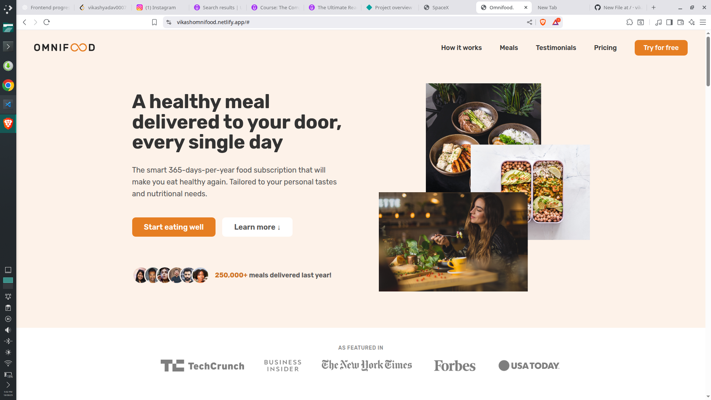

# 🍽️ Omnifood – Healthy Meal Delivery Website

A modern, fully responsive landing page for **Omnifood**, a subscription-based healthy meal delivery service.  
Built with **HTML5, CSS3, and Vanilla JavaScript** during the Jonas Schmedtmann course, with custom improvements.

🔗 **Live Demo**: [Omnifood Website](https://vikashomnifood.netlify.app/)

---

## ✨ Features

- 🎯 **Hero Section** with clear CTA (call-to-action)
- 📦 **How It Works** – step-by-step explanation
- 🥗 **Meals Showcase** – display of healthy recipes with ratings & diet labels
- ⭐ **Customer Testimonials** – social proof with avatar images
- 💰 **Pricing Plans** – Starter & Complete packages
- 📱 **Responsive Design** – optimized for desktop, tablet, and mobile
- 📩 **Newsletter Signup Form** with validation-ready fields
- 🗺️ **Footer** with contact details, app links, and social icons

---

## 🛠️ Tech Stack

- **HTML5** – semantic and accessible structure
- **CSS3** – responsive layouts (Flexbox, Grid), animations, and custom design system
- **JavaScript (Vanilla JS)** – basic interactivity (navigation, form)
- **Netlify** – hosting and deployment

---

## 📸 Screenshots

### Desktop View



---

## 🚀 Getting Started

### 1️⃣ Clone the repository
```bash
git clone https://github.com/your-username/omnifood.git

### 2️⃣ Navigate into project
cd omnifood

### 3️⃣ Open in browser
